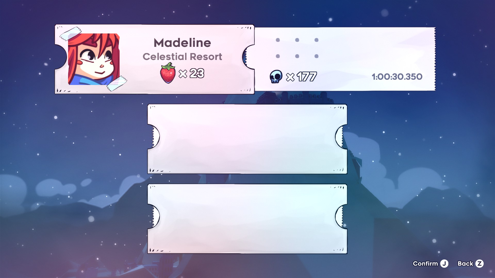
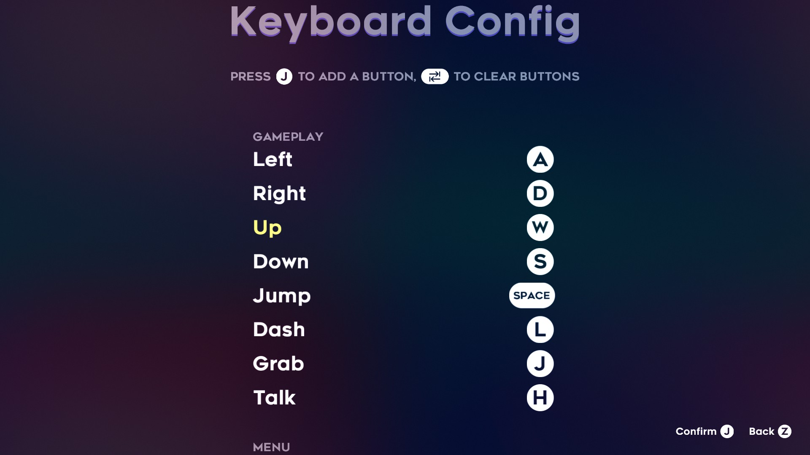
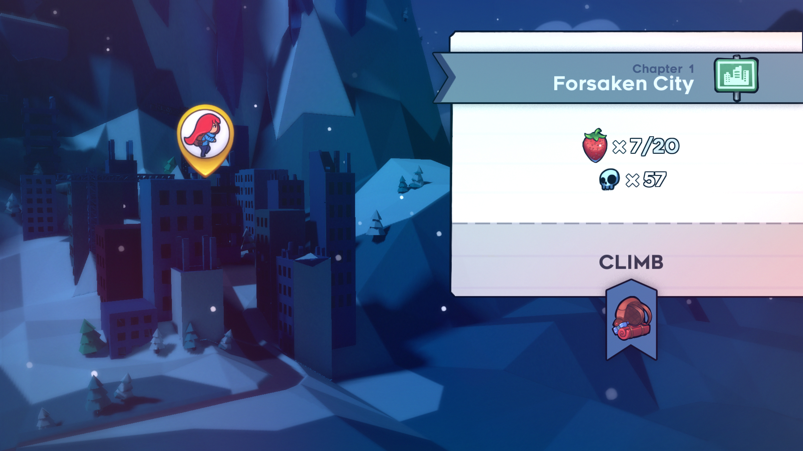
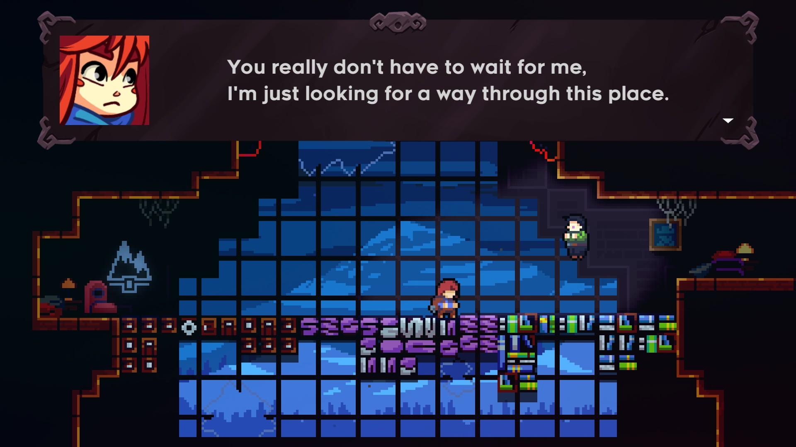

## Celeste

**Género:** Plataformas

**Acciones del Usuario:**

- **Menús:**
  - Menú principal.
  
  - Opciones.
  
  - Selector de guardado.
  

- **Controles:**
  - Se puede jugar con teclado o mando.
  - Las acciones básicas incluyen correr, saltar, agarrarte y escalar paredes por un tiempo limitado, y realizar un dash en el aire en una de ocho direcciones.
  

- **Progresión:**
  - El juego se desarrolla a través de niveles que requieren precisión y habilidad para completar.
  - Madeline puede recolectar gemas verdes que recargan su habilidad de dash sin necesidad de tocar el suelo.
  
  - El juego está dividido en capítulos, cada uno con su propio conjunto de desafíos y mecánicas.
  

- **Enemigos y Obstáculos:**
  - No hay enemigos tradicionales, pero hay numerosos obstáculos ambientales que deben ser superados mediante plataformas.
  - Incluye objetos mortales como púas que reinician la sección si Madeline muere.
  

- **Recompensas:**
  - Se pueden recolectar fresas como un desafío adicional, aunque no son necesarias para completar el juego.
  
  - Existen cintas de casete que desbloquean variaciones más difíciles de los niveles llamados "cara B".
  - Corazones ocultos permiten acceder a contenido posterior al juego.

- **Monetización:**
  - No está monetizado más allá de la compra inicial del juego.

- **Aspectos Interesantes:**
  - Celeste ofrece un "Modo Asistencia" que permite ajustar la dificultad del juego al gusto del jugador, incluyendo opciones como invencibilidad y dashes infinitos.
  
  - El juego aborda temas importantes como la salud mental, incluyendo ansiedad y depresión, lo cual se refleja en la narrativa del juego.
  - La música y el diseño de niveles han sido ampliamente elogiados por su calidad y originalidad.
  - El movimiento del personaje es considerado uno de los mejores de su género.
  - Incluye un modo en una pequeña consola llamada "Pico-8". En este modo el objetivo es llegar a la cima lo más rápido posible.
  

**Plataformas Disponibles:**
- Microsoft Windows, Nintendo Switch, PlayStation 4, Xbox One, macOS, y GNU/Linux.

**Desarrollador:**
- Maddy Makes Games.

**Historia:**
- El juego sigue a Madeline mientras intenta escalar la Montaña Celeste, enfrentándose a sus demonios internos y superando diversos desafíos físicos y emocionales.
- Existen otros personajes en el viaje a la cima, con los cuales podrás o deberás interactuar.

