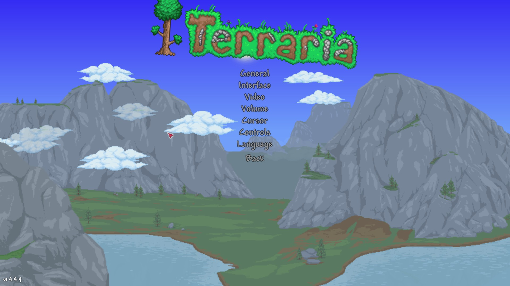
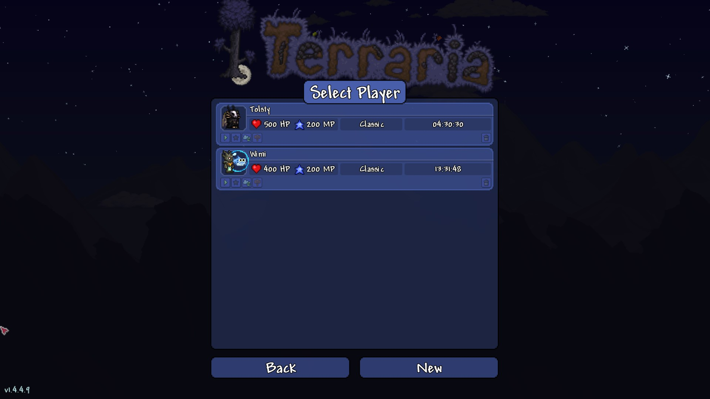
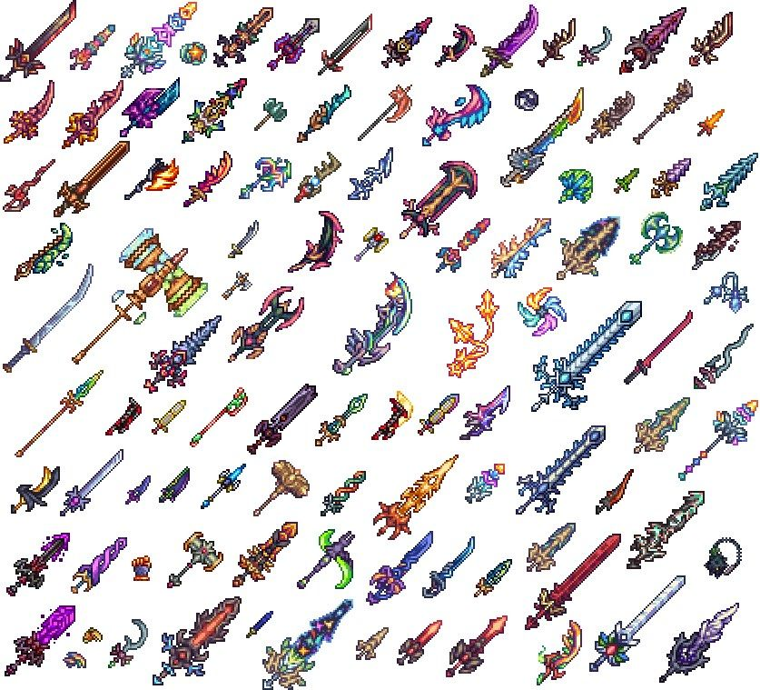
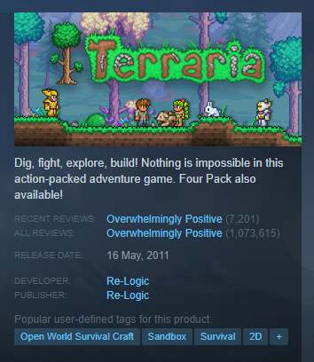

## Terraria

**Género:** Acción-aventura, Sandbox

**Acciones del Usuario:**

- **Menús:**
  - Menú principal.
  
  - Opciones.
  
  - Selector de personaje.
  

- **Controles:**
  - Se puede jugar con teclado y ratón o con controlador.
  - Las acciones están definidas por botones, permitiendo al jugador interactuar con el entorno, usar herramientas, y combatir enemigos.
  

- **Fases y progresión:**
  - El juego se desarrolla en un mundo abierto donde los jugadores pueden elegir cómo y cuándo avanzar.
  - El jugador comienza en un mundo generado aleatoriamente donde el deberá explorar, recolectar recursos, y construir su base.
  - La progresión se logra a través de la creación de herramientas y armas más avanzadas, así como derrotar a jefes para desbloquear nuevas áreas y contenido.
  - A medida que se progresa existen distintas fases:
    - Pre-Hardmode: Es la fase inicial y mas sencilla.
    - Hardmode: Se desbloquea al matar a un jefe en el inframundo, haciendo que todo se vuelva más difícil, pero desbloqueando nuevo equipamiento
    - Post-Plantera: Se desbloquea al matar a un jefe en la jungla, desbloqueando mas contenido y pudiendo así ir al jefe final.
    - Post-Moonlord: Se desbloquea al matar al jefe final, en esta fase se desbloquea el equipamiento más poderoso y usualmente el jugador se dedica a otras cosas como la construcción o decoración.

- **Vidas:**
  - Dependen del núcleo de tu personaje:
    - Viaje: Es el modo mas tranquilo, pues podrás duplicar objetos al llegar a una cuota requerida.
    - Clásico: El modo recomendado para los jugadores novatos, pues solo perderás la mitad de tu dinero.
    - Medio: En este modo no solo perderás todo tu dinero, que además soltarás todos tus items.
    - Extremo: En este modo morirás por completo, convirtiéndote en un fantasma, incapaz de afectar al mundo.
  

- **Enemigos y Obstáculos:**
  - Hay 3 dificultades para elegir en el mundo: [Modos de mundos](https://terraria.wiki.gg/es/wiki/Dificultad#Modos_de_Mundos)
  - El juego presenta una amplia variedad de enemigos que aparecen según la hora del día, el bioma y eventos especiales.
  - Los jugadores deben enfrentarse a numerosos jefes que ofrecen recompensas importantes al ser derrotados.
  

- **Recompensas:**
  - Al vencer jefes se desbloquean nuevos materiales que permiten crear mejores equipamientos.
  - Los jugadores pueden obtener una gran variedad de objetos, incluyendo armas, armaduras, pociones y accesorios al derrotar enemigos y explorar.
  

- **Monetización:**
  - Terraria no es gratuito; generalmente tiene un precio de alrededor de $20, aunque puede haber descuentos en plataformas como Steam.

- **Aspectos Interesantes:**
  - El juego incluye un sistema de crafting muy extenso que permite crear miles de objetos diferentes.
  - La exploración es un componente clave, con biomas únicos como desiertos, junglas y cavernas que ofrecen recursos exclusivos.
  - Terraria también cuenta con un modo multijugador que permite a los jugadores colaborar o competir entre ellos en el mismo mundo.
  - Hay una rica variedad de eventos especiales, easter eggs y crossovers que mantienen el interés del jugador a lo largo del tiempo.
  
  - Destaca su jugabilidad con mods gracias a su amplia comunidad. Esto se puede conseguir a traves de una aplicación a parte en steam llamada "TModLoader".
  
  - Terraria es el primero juego de Steam en llegar a un millón de reviews, y lo mejor es que son extremadamente positivas.
  

**Plataformas Disponibles:**
- Microsoft Windows, macOS, Linux, PlayStation 4, Xbox One, Nintendo Switch, iOS y Android.

**Desarrollador:**
- Re-Logic.

**Historia:**
- Terraria ofrece un mundo lleno de aventuras donde los jugadores pueden ser exploradores, constructores o guerreros. La libertad para personalizar su experiencia es uno de los mayores atractivos del juego.
