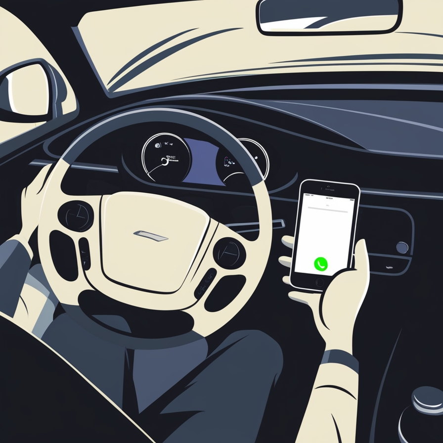
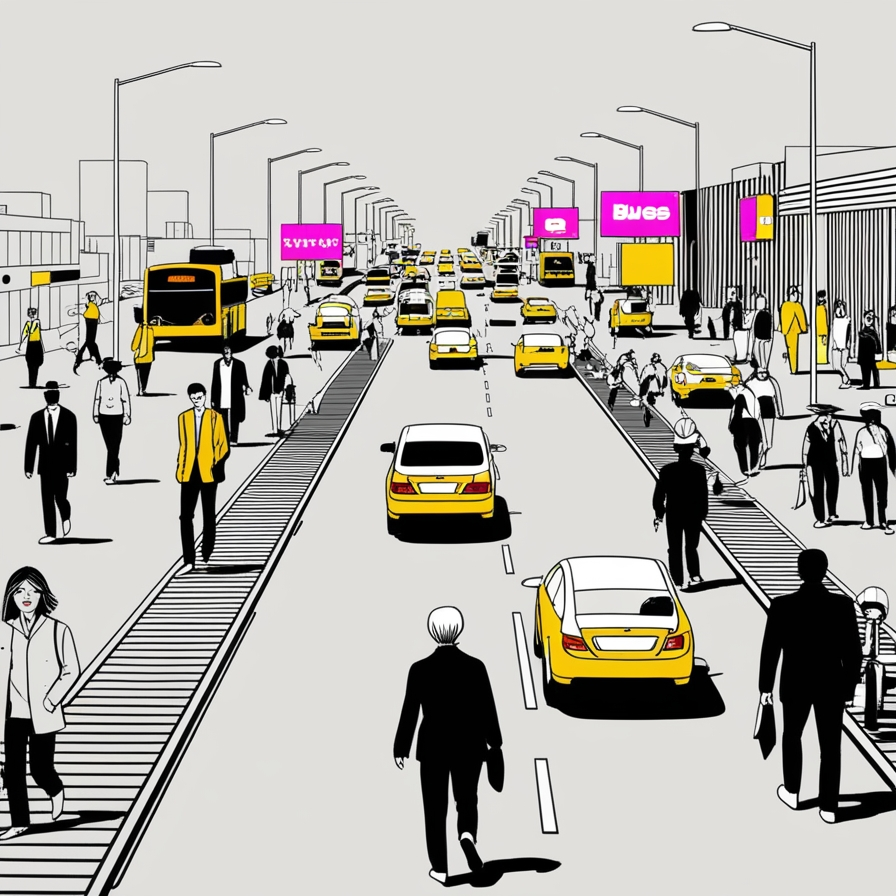

# Game Design Document: Distraction Disaster

## Portada
- **Título del juego**: Distraction Disaster
- **Logotipo**: 
- **Imagen representativa**: 
- **Desarrollador**: Wimsi Games (Gabriel Álvarez de Pablo) 

## Índice de contenidos
1. [Objetivos](#objetivos)
2. [Género y referencias](#género-y-referencias)
3. [Sinopsis de la historia](#sinopsis-de-la-historia)
4. [Aspectos relacionados con licencias](#aspectos-relacionados-con-licencias)
5. [Controles](#controles)
6. [Requisitos tecnológicos](#requisitos-tecnológicos)
7. [Señalética y diagramas de flujo](#señalética-y-diagramas-de-flujo)
8. [Diseño de niveles](#diseño-de-niveles)
9. [Cámara](#cámara)
10. [Personajes](#personajes)
11. [Enemigos y jefes](#enemigos-y-jefes)
12. [Personajes no jugables](#personajes-no-jugables)
13. [Armas](#armas)
14. [Métricas del jugador](#métricas-del-jugador)
15. [Inventario](#inventario)
16. [Mecánicas](#mecánicas)
17. [Mecanismos](#mecanismos)
18. [Arte conceptual](#arte-conceptual)
19. [Narrativa y guión](#narrativa-y-guión)
20. [Monetización](#monetización)
21. [Contenido descargable](#contenido-descargable)
22. [Secuencias cinemáticas](#secuencias-cinemáticas)
23. [Música y sonido](#música-y-sonido)

## Objetivos
- Descripción breve: Distraction Disaster es un juego de simulación que muestra las consecuencias de usar el móvil mientras se conduce, enseñando seguridad vial de manera interactiva y divertida.
- Público objetivo: Jóvenes conductores de 16 a 25 años.
- Plataformas: PC.
- Fecha de lanzamiento: 27 de mayo de 2025.

## Género y referencias
- Género principal: Simulación de conducción.
- Subgéneros: Educativo, arcade.
- Juegos de referencia:
    - "SMS Racing": Por la utilización del móvil mientras se conduce.
- Características únicas: Sistema de "Medidor de aburrimiento" que aumenta con el tiempo y debe ser saciado con el móvil.

## Sinopsis de la historia
- Contexto: El jugador es un conductor novato que debe realizar varias tareas diarias mientras conduce por la ciudad.
- Trama principal: Completar misiones diarias mientras se evitan accidentes y se aprende sobre los peligros de la distracción al volante.
- Personajes clave: El Protagonista, y "CHIP" (asistente de IA del coche).

## Aspectos relacionados con licencias
- Propiedad intelectual: Wimsi Games es propietario de todos los derechos.
- Colaboraciones: Asociaciones con organizaciones de seguridad vial para usar estadísticas y consejos reales.

## Controles
- Acelerar, frenar, girar el volante, poner el freno de mano, mirar el móvil, interactuar con el móvil e interactuar con "CHIP".

## Requisitos tecnológicos
- Windows 10 o superior, PC de gamma baja.
- Conexión a internet para funciones online y actualizaciones.
- Motor de juego: Unity 2024.2

## Señalética y diagramas de flujo
- Menú principal > Modo Historia / Selección de niveles / Configuración
- HUD: Velocímetro, mapa miniatura, medidor de aburrimiento, notificaciones del móvil.

## Diseño de niveles
- Estructura: Ciudad dividida en barrios, cada uno con sus propios desafíos.
- Objetivos: Llegar a destinos a tiempo mientras se manejan distracciones y se respetan las normas de tráfico.
- Progresión: Aumento gradual en la complejidad de las rutas y la frecuencia de las distracciones.

## Cámara
- Vista en primera persona desde el asiento del conductor.

## Personajes
- Personaje principal: Conductor personalizable.
- Habilidades: Mejora en la capacidad de multitarea y tiempo de reacción con la práctica.

## Enemigos y jefes
- No hay enemigos tradicionales, pero sí "jefes" en forma de situaciones de tráfico extremadamente complejas.

## Personajes no jugables
- Otros conductores, peatones y ciclistas con IA que reaccionan a las acciones del jugador.
- Pasajeros que pueden ser fuente de distracción o ayuda.

## Armas
- No aplica. En su lugar, el jugador tiene "herramientas" como el asistente de voz del coche o la opción de activar el modo "No molestar" del móvil.

## Métricas del jugador
- Puntuación de Seguridad: Basada en el respeto a las normas de tráfico y la minimización de distracciones.
- Nivel de aburrimiento: Aumenta con el tiempo y se sacia con el móvil o la conducción temeraria.
- Experiencia de Conductor: Desbloquea nuevas habilidades y misiones.

## Inventario
- Colección de aplicaciones en el móvil virtual.
- Mejoras para el coche o para "CHIP".

## Mecánicas
- Conducción realista con física simplificada.
- Sistema de notificaciones del móvil que requieren atención.
- Eventos de carretera como atascos o accidentes.
- Reconocimiento de señales de tráfico y semáforos.

## Mecanismos
- Sistema de recompensas: Desbloqueo de nuevas rutas y mejoras para el coche.
- Consecuencias: Los accidentes resultan en penalizaciones.
- Modo "Zen": Desactivar todas las distracciones para una conducción segura.

## Arte conceptual
- Estilo visual: 3D low poly con un toque realista para las señales de tráfico y la ciudad.
- Diseños: Interfaz de usuario que simula un smartphone real.
- Paleta de colores: Colores vivos para el entorno, contrastando con los tonos más sobrios del interior del coche.

## Narrativa y guión
- Estructura: Serie de días en la vida del protagonista, cada uno con sus propios desafíos.
- Arcos narrativos: Aprender a equilibrar la vida digital con la seguridad al volante.
- Diálogos clave: Interacciones con el Instructor y "CHIP" que proporcionan consejos de seguridad (es algo molesto, pero tiene razón).

## Monetización
- Modelo: Free-to-play con compras dentro de la aplicación.
- Microtransacciones: Cosméticos para el coche y el personaje, zonas nuevas.

## Contenido descargable
- Nuevos barrios de la ciudad con desafíos únicos.
- Eventos temáticos basados en festividades o campañas de seguridad vial reales.

## Secuencias cinemáticas
- Estilo: Mezcla de animación 3D y motion graphics para las estadísticas de seguridad.
- Momentos clave: Introducción del juego, escenarios de accidentes evitados, conclusiones de cada capítulo de la historia.

## Música y sonido
- Banda sonora dinámica que se atenúa con el nivel de aburrimiento.
- Radio interactiva.
- Efectos de sonido realistas para el tráfico y las notificaciones del móvil.
- Voces para el asistente de IA y ciertos personajes.
