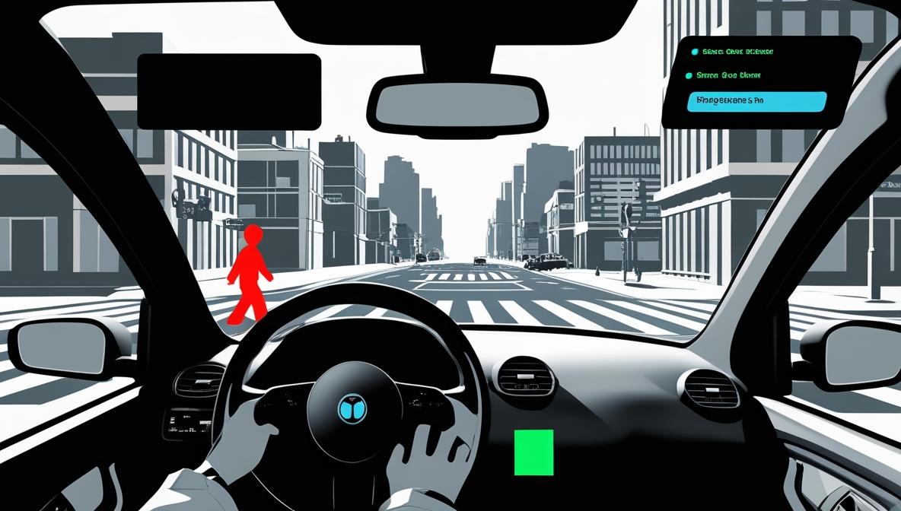

Autor: Gabriel (Wismy)

# **Diseño Visual de Distraction Disaster**

# Índice de Diseño Visual de Distraction Disaster

1. [Estilo de Arte](#estilo-de-arte)
2. [Personajes](#personajes)
3. [Elementos de Diseño](#elementos-de-diseño)
4. [Objetivo Visual](#objetivo-visual)

## Estilo de Arte

### Cel Shading
- Renderizado 3D con apariencia de dibujo animado
- Bordes definidos y sombreado plano
- Efecto visual que simplifica la representación

### Paleta Cromática
- Base: Escala de grises
- Acentos de color para elementos interactivos
  - Rojo: Alertas y peligros
  - Azul: Notificaciones digitales
  - Verde: Indicadores de progreso

## Personajes

### Protagonista
- Personalización completa:
  - Género
  - Tono de piel
  - Estilo de cabello
  - Rasgos faciales
  - Vestuario
  - Accesorios

### CHIP (Asistente IA)
- Personalidad: Servicial, pero se equivoca en ocasiones
- Función: Guía, advertencia y funcionalidades (coche, móvil...)

## Elementos de Diseño

### Tipografías
- Interfaz: Roboto
- Mensajes: Estilo smartphone
- Señalización: Oficial de tráfico, simplificada

### Visualización
- Vista previa en tiempo real
- Personaje visible en espejo retrovisor

## Objetivo Visual
- Resaltar distracciones
- Mantener estética monocromática
- Facilitar comprensión de mecánicas de juego
