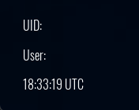
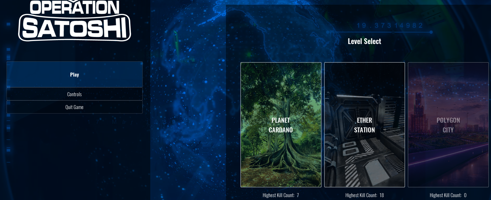
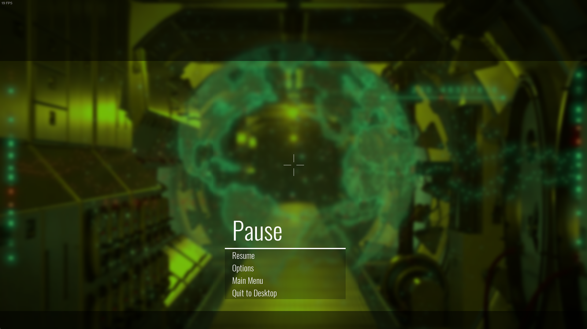
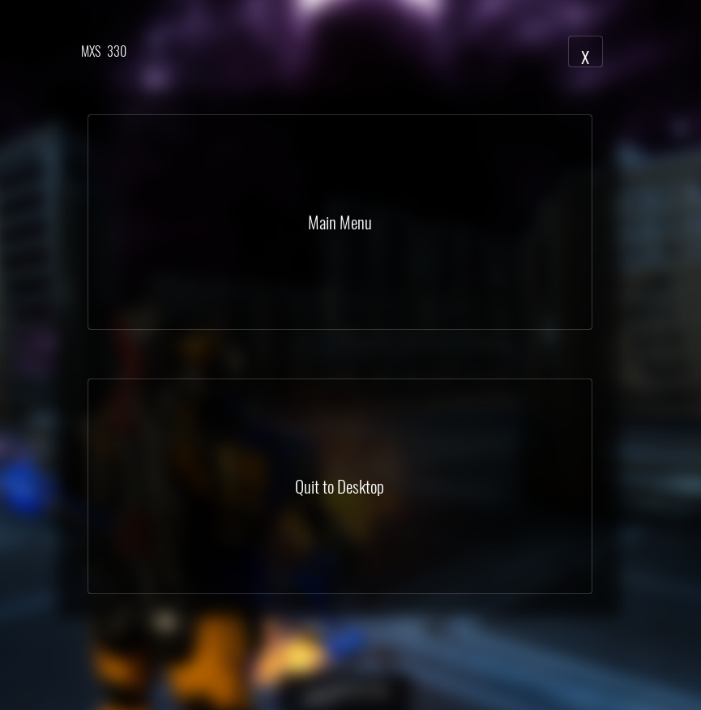

Autor: Gabriel (Wismy)

# Operation Satoshi \[Early Version Alpha\]: Informe de testing

### OS \[EVA\] | Windows 11 | Main Menu | Minor | Functional | Can´t click on buttons when ESC is pressed

#### Repro Rate
9/10

#### Descripción detallada
Una vez en alguna pantalla adyacente al menú principal (en la ruta), al darle a la tecla "ESC" los botones no funcionarán a la primera, pues habrá que darle a los mismos más de una sola vez.

#### Steps to reproduce
1. Abrir el menú de controles.
2. Darle a la tecla "ESC".
3. Clicar en el botón de la flecha (atrás).

#### Actual Result
Se mantiene en el mismo menú. Tras darle varias veces se verá la confirmación para salir del juego.

#### Expected Result
Confirmación para salir del juego o directamente al menú principal.

---

### OS \[EVA\] | Windows 11 | Main Menu | Minor | Text | UID and User not displayed

#### Repro Rate
10/10

#### Descripción detallada
En el menú principal, en la parte inferior izquierda aparece el UID y el User, pero no se muestra ningún valor.

#### Steps to reproduce
1. Abrir el menú principal.

#### Actual Result
No se muestra el valor del UID ni del User.

#### Expected Result
Se muestra el valor del UID ni del User.

#### Attachments

---

### OS \[EVA\] | Windows 11 | Main Menu | Minor | Text | Useless Play button

#### Repro Rate
10/10

#### Descripción detallada
En el menú principal, el botón de Play es inútil, ya que al seleccionar el mapa ya te redirige directamente a la siguiente pantalla.

#### Steps to reproduce
1. Abrir el menú principal.
2. Darle a Play.

#### Actual Result
El botón Play no hace nada.

#### Expected Result
El botón Play te lleva a la siguiente pantalla cuando haya un mapa seleccionado.

#### Attachments

---

### OS \[EVA\] | Windows 11 | In-game | Major | Functional | Pause menu interrupts player input

#### Repro Rate
10/10

#### Descripción detallada
El menú de pausa no es interactuable, y te quedas en él sin más opcion que cerrar el juego.

#### Steps to reproduce
1. Abrir el menú principal.
2. Seleccionar un mapa.
3. Darle al botón "Weapon ready".
4. Darle al botón "Play".
5. Darle a la tecla "P".

#### Actual Result
Menú de pausa interrumpe la entrada del usuario.

#### Expected Result
Menú de pausa es interactuable.

#### Attachments

---

### OS \[EVA\] | Windows 11 | In-game | Minor | Functional | Market key does´t open the market

#### Repro Rate
10/10

#### Descripción detallada
Mientras juegas, al darle a la tecla "M" para abrir el mercado, se abre el mismo menú que el de la tecla "ESC", que parece ser otro menú de pausa.

#### Steps to reproduce
1. Abrir el menú principal.
2. Seleccionar un mapa.
3. Darle al botón "Weapon ready".
4. Darle al botón "Play".
5. Darle a la tecla "M".

#### Actual Result
La tecla "M" abre el mismo menú que la tecla "ESC".

#### Expected Result
La tecla "M" abre el mercado.

#### Attachments

